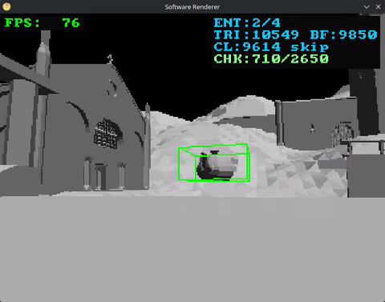

# Ronin - 3D Software Rendering Engine

This software implements a complete 3D graphics pipeline from scratch, utilizing the C23 standard. No external graphics APIs (such as OpenGL or Vulkan) are employed; all rasterization, geometric transformations, and clipping operations are computed on the CPU. The SDL2 library is utilized exclusively for window instantiation, input polling, and the final presentation of the framebuffer.

| Spawning Spinning Teapot | Ray Tracing Demonstration |
|:------------------------:|:-------------------------:|
|  |  |

## Features

### Core Architecture
*   **Minimal Dependency Implementation**: Constructed purely in C23, utilizing `stb_image` solely for image loading.
*   **Memory Management**: Arena-based allocation strategies are favored over per-frame dynamic allocations.
*   **Console & Logging**: An integrated Quake-style console allows for runtime variable manipulation and execution of commands. A robust logging system provides colored output and file tracing.

### Graphics Pipeline
*   **Software Rasterization**: Triangle setup and scanline traversal are performed manually.
*   **Texture Mapping**: Perspective-correct interpolation is applied to UV coordinates.
*   **Clipping**: Geometry is clipped against the view frustum using the Sutherland-Hodgman algorithm.
*   **Lighting**: Dynamic point lights and ambient illumination are calculated per-vertex (Gouraud shading).

### Physics & Simulation
*   **Camera System**: A six-degree-of-freedom FPS camera is implemented with Euler angle constraints.
*   **Collision Detection**: Axis-Aligned Bounding Boxes (AABB) are generated for all meshes.
*   **Collision Resolution**: Wall sliding is implemented to prevent movement blockage.
*   **Ray Casting**: Screen-to-world ray projection is supported for entity selection and interaction.

### Asset Management
*   **Model Loading**: a custom parser for Wavefront `.obj` files is included.
*   **Level System**: Static geometry and dynamic entities are loaded from custom `.lvl` files.

### Optimizations
*   **Visibility Determination**: Z-Buffering (with Early Z-Rejection), Frustum Culling, and Backface Culling are implemented for scene optimization.
*   **Spatial Partitioning**: A Grid/Bucket system is utilized to reduce the computational complexity of tracking physics interactions.
*   **Chunking**: Large meshes are subdivided into chunks to maximize culling efficiency.
*   **Chunk Sorting**: Maximize Early-Z Rejection by sorting chunks front-to-back.

## Usage
The compilation is handled via the provided `Makefile`.

To build the executable:
```sh
make
```

## Configuration
Runtime configuration parameters can be modified via the internal console, accessed by pressing the tilde (`~`) key.

## Credits
*   **Maps**: [Sauerbraten Game Maps](https://github.com/Calinou/game-maps-obj).
*   **Utah Teapot**: [Original Dataset](https://graphics.cs.utah.edu/teapot/).